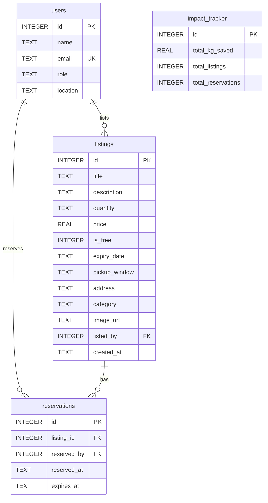

# FoodShare Pretoria - Flask Application

A fully functional Flask web application for FoodShare Pretoria, a food-waste reduction platform connecting restaurants, shops, charities, and individuals to reduce food waste in the Pretoria community.

## Overview

FoodShare Pretoria allows businesses to list surplus food instead of throwing it away, while community members can discover and reserve food items—either for free or at reduced prices. This application features server-side rendering with Flask and Jinja2 templates, a SQLite database, and full CRUD functionality.

## Features

This application includes:
- **Server-Side Rendering**: Flask with Jinja2 templates for dynamic page generation
- **Database Integration**: SQLite with full CRUD operations
- **User Flows**: Browse listings, view details, create listings, reserve items, and track community impact
- **File Uploads**: Image upload system with validation and secure storage
- **Flash Messages**: User feedback for actions (success, warnings, errors)
- **Responsive Design**: Bootstrap 5 styling with mobile-first approach

## Project Structure

```
BFB/
├── README.md                          # This file
├── README_FLASK.md                    # Flask setup and deployment guide
├── app.py                             # Main Flask application
├── content-mapping.md                 # HTML-to-Database mapping guide
├── db/
│   ├── foodshare.db                  # SQLite database (created on first run)
│   └── foodshare-schema-seed.sql     # Database schema and seed data
├── templates/                         # Jinja2 templates
│   ├── base.html                     # Base template with navigation
│   ├── index.html                    # Landing page (homepage)
│   ├── browse-listings.html          # Main listing feed
│   ├── listing.html                  # Individual listing detail page
│   ├── create-listing.html           # Create new listing form
│   └── impact.html                   # Community impact tracker
└── static/                           # Static assets
    ├── css/
    │   └── styles.css                # Custom styles
    ├── images/                       # SVG placeholder images
    │   ├── lasagna.svg
    │   ├── bread.svg
    │   ├── veggies.svg
    │   └── hero-banner.svg
    └── uploads/                      # User-uploaded images
```

## Application Routes

### 1. Landing Page (`/`)
The homepage provides an introduction to FoodShare Pretoria:
- **Hero Section**: Eye-catching banner with call-to-action buttons
- **Live Statistics**: Dynamic community impact pulled from database
- **Introduction**: How the platform serves businesses, charities, and individuals
- **Background**: Food waste challenge in South Africa
- **How It Works**: Three-step process for listing, finding, and collecting food
- **About Us**: Mission, vision, and values

### 2. Browse Listings (`/listings`)
Shows all available food listings dynamically:
- **Dynamic Cards**: All listings from database with images, titles, and metadata
- **Reservation Status**: Visual indicators for reserved items with expiry times
- **Free Items**: Badge indicators for free listings
- **Owner Information**: Display of donor/lister name and role

### 3. Listing Detail (`/listing/<id>`)
Detailed view of a single listing:
- **Full Details**: Category, quantity, price, expiry date, pickup window
- **Owner Information**: Contact details and location
- **Reserve Button**: Functional reservation system (1-hour expiry)
- **Status Indicators**: Shows if item is already reserved

### 4. Create Listing (`/create`)
Form for creating new food listings:
- **Full Form**: All database fields with validation
- **Image Upload**: Support for PNG, JPG, JPEG, GIF, SVG (5MB max)
- **Category Selection**: Dropdown with predefined categories
- **Backend Submission**: Creates database entry and redirects to detail page

### 5. Impact Tracker (`/impact`)
Community impact dashboard with live data:
- **Total Impact**: Food saved, listings, and reservations from database
- **Category Breakdown**: Distribution of food by category
- **Role Breakdown**: Participation by user type
- **Environmental Metrics**: CO₂ and water savings calculations

## Database

The SQLite schema (`db/foodshare-schema-seed.sql`) includes:

### Entity Relationship Diagram



### Tables
- **users**: Donors and recipients (4 sample users)
- **listings**: Available food items (3 sample listings)
- **reservations**: Booking records (1 sample reservation)
- **impact_tracker**: Aggregated impact statistics

### Seed Data
- **Users**: Bella's Bakery (donor), Green Grocer PTA (donor), FeedPTA Charity (recipient), Jane Smith (individual)
- **Listings**: Lasagna, Artisan Bread (reserved), Fresh Vegetables
- **Reservations**: FeedPTA Charity reserved bread from Bella's Bakery
- **Impact**: 37.5 kg saved, 75 kg CO₂ reduced, 7500 L water conserved

## Technologies

- **Flask**: Python web framework for server-side rendering
- **Jinja2**: Template engine for dynamic HTML generation
- **SQLite3**: Lightweight relational database with Row factory
- **Werkzeug**: File upload handling and security utilities
- **Python**: datetime module for reservation expiry logic
- **HTML5**: Semantic markup with accessibility features
- **CSS3**: Custom styling with CSS variables, flexbox, and grid
- **Bootstrap 5.3.3**: Responsive grid system, components, and utilities
- **Bootstrap Icons 1.11.3**: Icon set for UI elements

## Features

### Backend Features
- **Database Layer**: SQLite connection with Row factory for dict-like access
- **Auto-initialization**: Database created from schema on first run
- **File Uploads**: Secure filename handling with timestamp prefixes
- **Flash Messages**: Bootstrap-styled alerts for user feedback
- **Error Handling**: Custom 404 handler with user-friendly redirects
- **Template Inheritance**: Base template with blocks for DRY code


---

**FoodShare Pretoria** - Fighting Food Waste, One Meal at a Time 🌱

